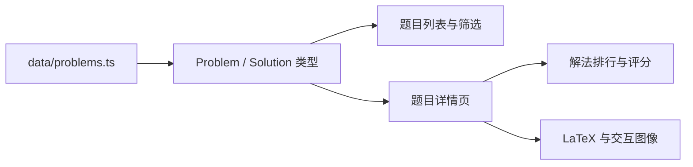

# ProofArena

> 同一道题，多种解法，正面交锋。

ProofArena 是一个面向高中数学学习者与教师的“解法竞技场”。它不把“找到答案”当作终点，而是把标准解、结构解、考场解和讲解路线放在同一个页面中，从正确性、考场性、优雅度、计算量、讲解友好度五个维度进行比较。

当前项目是一个可运行的静态 Demo，首批内容聚焦 **2026 天津卷数学第 16-20 题**。

## Demo 能做什么

- 浏览经过人工校订的高考数学题目
- 搜索并按卷别、题型、专题筛选
- 查看“这题怎么想到”、观察入口与思路触发词
- 在“只看思路 / 关键转化 / 完整解法”之间切换
- 比较多种解法的五维评分与评分理由
- 查看人工验证状态与可复核步骤
- 在导数、圆锥曲线题中使用交互式图像实验
- 切换跟随系统、浅色、深色主题
- 从站内模板发起 GitHub Issue 解法投稿

## 页面地图

| 路径 | 用途 |
| --- | --- |
| `/` | 首页、热门擂台与项目状态 |
| `/problems` | 题目列表、搜索和筛选 |
| `/problems/[id]` | 题干、学习导航、排行榜、解法卡片与图像实验 |
| `/submit` | 投稿规则、Markdown 模板与 GitHub Issue 入口 |
| `/about` | 项目目标、Demo 状态与开放协议 |

## 技术栈

- Next.js App Router
- React + TypeScript
- Tailwind CSS v4
- KaTeX / react-katex
- JSXGraph
- Lucide React
- 静态导出，无数据库、无登录、无后端

## 快速开始

环境建议：

- Node.js 20+
- npm 10+

```bash
git clone https://github.com/XuanheGuo/ProofArena.git
cd ProofArena
npm install
npm run dev
```

打开 [http://localhost:3000](http://localhost:3000)。

提交代码前运行：

```bash
npm run lint
npm run build
```

`npm run lint` 当前执行 TypeScript 类型检查；`npm run build` 同时验证静态页面生成。

## 项目结构

```text
ProofArena/
├── app/                        # App Router 页面、全局样式与静态路由
│   ├── problems/[id]/page.tsx # 题目详情页
│   ├── submit/page.tsx        # 投稿说明页
│   └── about/page.tsx         # 项目说明页
├── components/                 # 题目卡片、解法卡片、主题、公式和图像组件
├── data/problems.ts            # 当前全部题目与解法数据
├── lib/types.ts                # Problem、Solution、评分与验证类型
├── public/papers/              # 页面引用的来源试卷文件
├── docs/                       # 架构、内容、评分与路线图文档
└── types/                      # 第三方库类型补充
```

数据流非常直接：



当前没有 API 层和持久化层。修改题目内容时，主要工作区是 `data/problems.ts`；修改体验时，主要工作区是 `app/` 与 `components/`。

## 从哪里开始贡献

如果你是前端开发者：

- 改善移动端阅读、键盘可访问性和主题一致性
- 为筛选状态增加 URL 参数
- 为解法卡片补充更好的分享与打印体验
- 将图像实验抽象为可配置的可视化系统

如果你是数学教师或内容编辑：

- 校订现有解法的严谨性与考场书写
- 补充真正不同的第二、第三种解法
- 改进“怎么想到”、易错点和验证步骤
- 对五维评分给出可审查的理由

如果你想理解代码：

1. 阅读 [架构说明](./docs/ARCHITECTURE.md)
2. 查看 [数据与内容规范](./docs/CONTENT_GUIDE.md)
3. 阅读 [评分规则](./docs/SCORING.md)
4. 按 [贡献指南](./CONTRIBUTING.md) 完成第一次修改

## 文档

- [架构说明](./docs/ARCHITECTURE.md)
- [内容与数据规范](./docs/CONTENT_GUIDE.md)
- [五维评分规则](./docs/SCORING.md)
- [路线图](./docs/ROADMAP.md)
- [贡献指南](./CONTRIBUTING.md)

## 当前限制

- 数据仍直接维护在单个 TypeScript 文件中
- 投稿需要人工通过 GitHub Issue 审核和合并
- CAS 状态主要表示人工复核信息，尚未连接真正的计算机代数服务
- 交互图像目前按题目 ID 编写，尚未形成通用配置协议
- 当前题量有意保持较少，优先验证内容质量与学习体验

## 协议

本仓库采用双协议：

- **程序代码：AGPL-3.0-only**  
  包括 `app/`、`components/`、`lib/`、配置、样式与其他程序实现。完整条款见 [LICENSE](./LICENSE)。
- **题目整理与解法内容：CC BY-SA 4.0**  
  包括 `data/problems.ts` 中由项目编辑形成的题目说明、学习指南、解法表达、评分理由和其他原创内容。完整条款见 [LICENSE-CONTENT](./LICENSE-CONTENT)。

原始考试题目、试卷扫描件及参考答案的权利归各自权利人所有，不因收录于本仓库而改变。提交解法即表示投稿者确认有权以 CC BY-SA 4.0 提供该内容。

## 项目状态

ProofArena 仍处于 Demo 阶段。现在最重要的不是快速扩充题量，而是建立一套能持续产出、审核和比较高质量题解的方法。
