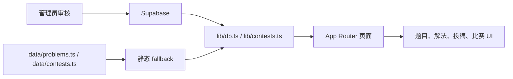

# ProofArena

> 同一道题，多种解法，正面交锋。

ProofArena 是一个面向高中数学学习者、教师和内容贡献者的解法竞技场。它不把“做出答案”当作终点，而是把标准解、巧解、结构解、教学解、错解分析和赛后讨论放在同一个场域里，从正确性、考场性、结构美感、计算负担和讲解友好度等角度公开比较。

项目正在从高质量静态样板，过渡到 Supabase 支撑的社区投稿、审核和比赛活动。没有配置 Supabase 时，站点会回退到仓库内的静态题库和默认比赛数据；配置 Supabase 后，题目、解法、投稿、用户、比赛、评分和奖项会走数据库。

## 当前能力

- 浏览高考数学题目，按卷别、题型、难度和专题筛选
- 阅读题干、学习提示、思路树、概念边界和多条解法
- 在“只看思路 / 关键转化 / 完整解法”之间渐进展开
- 比较解法的五维评分、适用场景、代价和验证状态
- 使用 KaTeX 渲染数学公式，部分题目提供 JSXGraph 图像实验
- 用户注册登录后投稿新题或新解法
- 管理员审核投稿，并可发布到题库或解法库
- 创建比赛活动，安排每日题目、提交窗口、互评、榜单和奖项
- 在无数据库环境下使用静态 fallback，保证页面可预览和部署

## 页面地图

| 路径 | 用途 |
| --- | --- |
| `/` | 首页、精选题目、比赛入口和项目状态 |
| `/problems` | 题目列表、搜索和筛选 |
| `/problems/[id]` | 题干、学习导航、解法比较、图像实验和比赛上下文 |
| `/library` | 知识模块、概念边界和学习材料 |
| `/submit` | 新题投稿、解法投稿和比赛投稿入口 |
| `/studio` | 结构化解法工作台 |
| `/profile` | 当前用户的投稿记录 |
| `/contests` | 比赛活动列表 |
| `/contests/[slug]` | 比赛详情、赛题安排、提交入口、榜单和奖项 |
| `/admin/submissions` | 投稿审核与发布 |
| `/admin/contests` | 比赛、赛题和奖项管理 |
| `/about` | 项目理念、状态和协议说明 |

## 技术栈

- Next.js App Router + React + TypeScript
- Tailwind CSS v4
- Supabase Auth / Database / RLS
- KaTeX / react-katex
- JSXGraph
- Lucide React
- Vercel 或 Node.js standalone 部署

## 快速开始

环境建议：

- Node.js 20 或 22（LTS，参见 `.nvmrc`）；不建议使用 Node 25 等非 LTS 版本 —— 本仓库在 Node 25 下 `npm run build:webpack` 会在 webpack 的 WasmHash 步骤崩溃
- npm 10+

```bash
npm install
npm run dev
```

打开 [http://localhost:3000](http://localhost:3000)。

提交前运行：

```bash
npm run lint
npm run build:webpack
```

`npm run lint` 当前执行 TypeScript 类型检查。`npm run build:webpack` 是本地沙箱里更稳的生产构建验证；普通环境也可以使用 `npm run build`。

## Supabase 可选配置

没有 `.env.local` 时，应用会使用 `data/problems.ts` 和 `data/contests.ts` 的静态数据。要启用登录、投稿、审核、评分和比赛后台，复制模板并填入真实值：

```bash
cp .env.example .env.local
```

```bash
NEXT_PUBLIC_SUPABASE_URL=...
NEXT_PUBLIC_SUPABASE_ANON_KEY=...
SUPABASE_SERVICE_ROLE_KEY=...
```

`.env.local` 已在 `.gitignore` 中，切勿提交真实密钥；`.env.example` 只包含变量名，可安全提交。

然后按顺序执行 `supabase/migrations/001_initial_schema.sql` 到 `008_contest_thought_arena.sql`。详细说明见 [Supabase 设置](./docs/SUPABASE_SETUP.md)。

已有静态题库可以迁移到 Supabase：

```bash
npm run seed
```

## 项目结构

```text
ProofArena/
├── app/                    # App Router 页面、路由和全局样式
├── components/             # 题目、解法、投稿、后台、比赛和通用 UI
├── data/                   # 静态 fallback 题库、比赛和知识数据
├── lib/                    # 类型、数据访问、Supabase、比赛和展示逻辑
├── public/papers/          # 页面引用的来源试卷文件
├── supabase/migrations/    # 数据库 schema、RLS 和增量修复脚本
├── docs/                   # 架构、内容、评分、比赛和部署文档
└── scripts/                # seed、standalone 准备和内容修复脚本
```

核心数据流：



## 主要文档

- [架构说明](./docs/ARCHITECTURE.md)
- [Proof Graph 超级改造纲领](./docs/PROOF_GRAPH_TRANSFORMATION.md)
- [Supabase 设置](./docs/SUPABASE_SETUP.md)
- [比赛模块](./docs/CONTESTS.md)
- [第一场比赛启动方案](./docs/FIRST_CONTEST_PLAN.md)
- [CAS 校验服务](./docs/CAS.md)
- [内容与数据规范](./docs/CONTENT_GUIDE.md)
- [五维评分规则](./docs/SCORING.md)
- [路线图](./docs/ROADMAP.md)
- [贡献指南](./CONTRIBUTING.md)

## 从哪里开始贡献

前端开发者优先看 `app/`、`components/` 和 [架构说明](./docs/ARCHITECTURE.md)。涉及比赛请先看 [比赛模块](./docs/CONTESTS.md)。

数学内容贡献者优先看 [内容与数据规范](./docs/CONTENT_GUIDE.md) 和 [五维评分规则](./docs/SCORING.md)。ProofArena 更重视高质量、可复核、可比较的少量内容，而不是快速堆题量。

运营或审核贡献者优先看 [Supabase 设置](./docs/SUPABASE_SETUP.md)、`/admin/submissions` 和 `/admin/contests` 的工作流。

## 当前限制

- 静态数据和 Supabase 数据仍并存，需要保持字段契约一致
- 数据库 migration 是手动 SQL 流程，尚未接入 Supabase CLI
- 题库内容验证还没有构建期 schema
- 比赛思路互评刚进入 008 migration，前后台写入与展示仍需要继续打磨
- JSXGraph 可视化仍按题目特化，尚未形成通用配置协议
- 自动化测试很少，主要依赖 TypeScript 和生产构建兜底

## 协议

本仓库采用双协议：

- **程序代码：AGPL-3.0-only**  
  包括 `app/`、`components/`、`lib/`、配置、样式与其他程序实现。完整条款见 [LICENSE](./LICENSE)。
- **题目整理与解法内容：CC BY-SA 4.0**  
  包括由项目编辑形成的题目说明、学习指南、解法表达、评分理由和其他原创内容。完整条款见 [LICENSE-CONTENT](./LICENSE-CONTENT)。

原始考试题目、试卷扫描件及参考答案的权利归各自权利人所有，不因收录于本仓库而改变。提交内容即表示投稿者确认有权按对应协议提供该内容。
