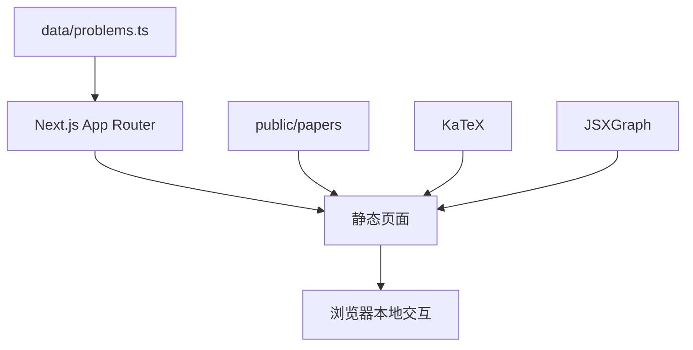

# 架构说明

本文帮助开发者快速理解 ProofArena 当前 Demo 的边界、数据流和扩展位置。

## 设计原则

1. **静态优先**：所有页面可由 `next build` 静态生成。
2. **内容优先**：复杂度应服务于题解阅读，不为未来假设提前引入后端。
3. **渐进阅读**：学生先看思路，再看关键转化，最后展开完整过程。
4. **可比较**：不同解法遵循同一数据结构和评分维度。
5. **可核对**：题目来源、验证状态和评分理由必须可见。

## 运行边界

ProofArena 当前是纯前端应用：



没有数据库、服务端 API、账号系统或运行时内容管理。React state 只用于主题、筛选和解法展开等本地交互。

## 路由

### `/`

首页由 `app/page.tsx` 实现。它直接读取 `problems`，选择指定题目作为热门擂台。

### `/problems`

列表页由服务端页面 `app/problems/page.tsx` 和客户端组件 `ProblemExplorer` 组成。

- 页面负责传入全部静态数据
- 客户端组件负责搜索和筛选
- `ProblemCard` 负责计算并展示对决摘要

### `/problems/[id]`

详情页使用 `generateStaticParams()` 为每道题生成静态路径。

主要区域：

- 题目元信息和题干
- 阅读路径导航
- 学习提示
- 可选交互图像
- 学习对象推荐
- 解法导航
- `SolutionCard` 解法详情
- 投稿入口

### `/submit` 与 `/about`

两者都是静态说明页。复制模板是唯一客户端交互，由 `CopySubmissionTemplate` 管理。

## 组件职责

| 组件 | 职责 |
| --- | --- |
| `SiteHeader` | 全局导航、仓库入口与主题控制 |
| `ThemeToggle` | system/light/dark 状态与本地存储 |
| `ProblemExplorer` | 搜索、卷别、题型和专题筛选 |
| `ProblemCard` | 列表摘要、最佳解法对决和学习指数 |
| `SolutionCard` | 三层阅读状态、完整步骤、评分与验证 |
| `ScoreBar` | 单项评分可视化 |
| `VerificationPanel` | 验证状态和检查项 |
| `MathBlock` | 混排文本中的行内 LaTeX |
| `MathVisualization` | JSXGraph 图像实验 |

## 数据层

`data/problems.ts` 是当前唯一数据源。它导出：

- `problems`
- `getProblem`
- `getAverageScore`
- `getSolutionAverage`
- `getBestSolution`
- `getLearningIndex`

类型契约位于 `lib/types.ts`。

这个设计适合少量高质量样板，但不适合数百题规模。数据增长前应先拆分为按试卷或题目组织的模块，而不是继续扩大单文件。

建议的下一阶段结构：

```text
data/
├── index.ts
├── papers/
│   └── tj-2026.ts
└── problems/
    ├── tj-2026-16.ts
    └── tj-2026-17.ts
```

## 评分计算

参考均分是五维评分的算术平均值。学习指数使用：

```text
讲解友好最高分 × 0.50
+ 考场性最高分 × 0.25
+ 结构美感最高分 × 0.25
```

这些计算目前属于展示逻辑，不是不可变的学术标准。调整公式时应同步更新 `docs/SCORING.md`。

## 主题

主题状态有三种模式：

- `system`
- `light`
- `dark`

`app/layout.tsx` 中的内联脚本在 React hydration 前写入 `data-theme`，避免首屏闪烁。`ThemeToggle` 负责后续切换和 `localStorage` 持久化。

浅色主题通过 `app/globals.css` 对常用深色 utility class 做映射。新增颜色或背景类时需要同时验证浅色效果。

## 数学渲染

`MathBlock` 将包含 `$...$` 的字符串拆分为普通文本和 `InlineMath`。当前不支持复杂 Markdown AST，也不支持块级 `$$...$$` 语法。

新增内容时：

- 使用 `$...$` 包裹公式
- TypeScript 字符串内使用双反斜杠，例如 `\\frac`
- 避免把中文标点放进数学环境

## 交互图像

`MathVisualization` 按 `problemId` 查找可视化配置，并调用对应绘制函数。当前是题目特化实现。

新增图像需要：

1. 添加 `VisualizationSpec`
2. 实现绘制函数
3. 在详情页的 `hasVisualization` 集合中登记 ID
4. 验证主题切换、移动端尺寸、拖动、缩放与重置

长期方向是将坐标范围、曲线、点、滑块与说明抽象成数据配置。

## 静态导出约束

`next.config.ts` 设置了 `output: "export"`。开发时应避免：

- 依赖运行时服务端逻辑
- 使用数据库或服务端 session
- 引入必须由 Next Image 服务处理的图片
- 创建没有 `generateStaticParams` 的动态内容路径

## 已知技术债

- 数据文件过于集中
- 没有自动化单元测试
- `lint` 实际只执行 TypeScript 检查
- 可视化按题目硬编码
- 筛选状态未写入 URL
- 内容验证没有机器可执行的 schema
- PDF 版权与分发策略需要随项目规模进一步明确
