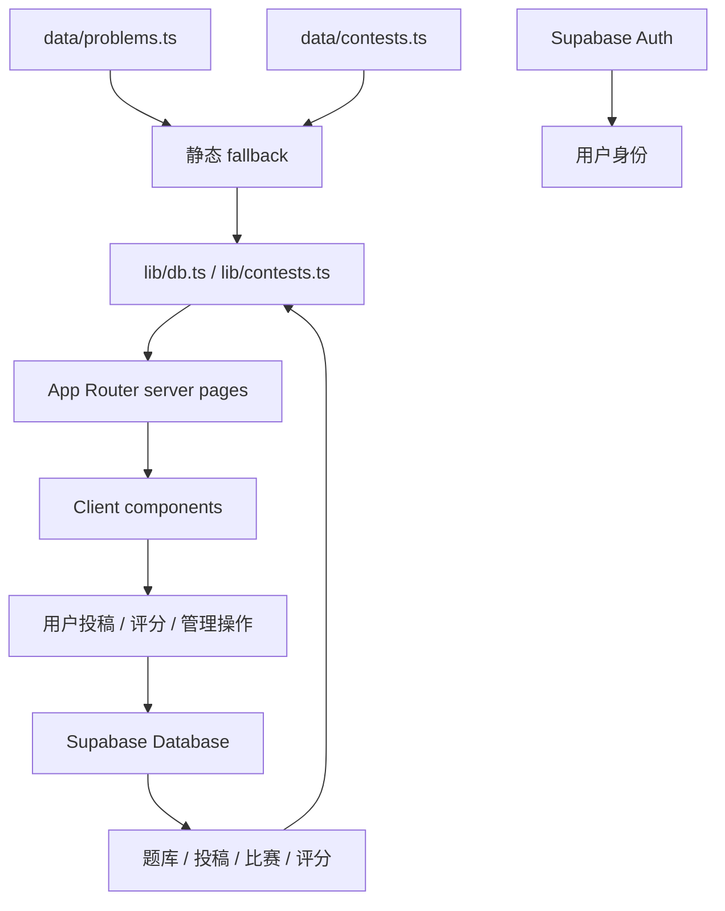

# 架构说明

本文帮助开发者快速理解 ProofArena 的运行边界、数据流、页面模块和扩展位置。

## 产品边界

ProofArena 当前有两种运行形态：

1. **静态 fallback 模式**：没有 Supabase 环境变量时，页面读取 `data/problems.ts`、`data/contests.ts` 和其他本地数据。适合本地开发、纯前端预览和内容校对。
2. **社区模式**：配置 Supabase 后，用户、投稿、审核、题库、解法、比赛、评分和奖项走数据库。静态数据仍作为数据库为空或查询失败时的兜底。

因此不要再把项目理解成“无后端纯静态 Demo”。更准确的边界是：Next.js 前端优先，Supabase 提供轻量社区和后台能力，静态数据保证最小可运行体验。

## 设计原则

1. **内容优先**：技术复杂度必须服务于题解阅读、比较、投稿和沉淀。
2. **渐进阅读**：学生先看题，再看思路、关键转化、完整解法和讨论。
3. **可比较**：不同解法遵循同一数据结构和评分维度。
4. **可核对**：来源、验证状态、评分理由、审核状态和投稿归属必须清楚。
5. **静态兜底**：数据库不可用时，核心页面仍应能显示静态题库和默认比赛。
6. **后台克制**：管理员能力集中在投稿审核、比赛配置和奖项维护，不提前做复杂 CMS。

## 数据流



核心约定：

- `lib/db.ts` 负责题目和解法读取。Supabase 缺失、查询失败或空表时回退到静态题库。
- `lib/contests.ts` 负责比赛、统计、榜单和赛后内容读取。Supabase 缺失时返回静态比赛或空统计。
- `lib/types.ts` 是前端领域类型的中心。改数据库字段时，必须同步检查这里和 mapper。
- `supabase/migrations/` 是数据库真相来源。新增持久化能力必须提供 migration。

## 路由

| 路由 | 说明 | 主要入口 |
| --- | --- | --- |
| `/` | 首页、项目状态和精选内容 | `app/page.tsx` |
| `/problems` | 题目浏览、搜索和筛选 | `app/problems/page.tsx`、`ProblemExplorer` |
| `/problems/[id]` | 题目详情、学习路径、解法比较和比赛上下文 | `app/problems/[id]/page.tsx` |
| `/library` | 知识、概念和洞察内容 | `app/library/page.tsx` |
| `/submit` | 新题、解法、比赛解法投稿 | `app/submit/page.tsx`、`SubmitForm` |
| `/studio` | 结构化解法撰写工作台 | `app/studio/page.tsx`、`StudioWorkspace` |
| `/profile` | 用户投稿记录 | `app/profile/page.tsx` |
| `/contests` | 比赛列表 | `app/contests/page.tsx` |
| `/contests/[slug]` | 比赛详情、赛题、榜单和奖项 | `app/contests/[slug]/page.tsx` |
| `/admin/submissions` | 投稿审核和发布 | `AdminSubmissionsView` |
| `/admin/contests` | 比赛、赛题和奖项管理 | `AdminContestsView` |

## 组件职责

| 组件 | 职责 |
| --- | --- |
| `SiteHeader` | 全局导航、仓库入口、主题和登录入口 |
| `ProblemExplorer` | 题目搜索、卷别、题型、难度和专题筛选 |
| `ProblemDetailExperience` | 题目详情页的主要阅读体验 |
| `SolutionCard` / `SolutionTreePanel` | 解法分层阅读、思路树和评分展示 |
| `ConceptBoundaryPanel` | 概念辨析、边界题和为什么不用某法 |
| `MathBlock` | 混排文本中的行内 LaTeX |
| `MathVisualization` | JSXGraph 题目特化图像实验 |
| `SubmitForm` | 新题、普通解法和比赛解法投稿 |
| `StudioWorkspace` | 解法结构化编辑和提交 |
| `AdminSubmissionsView` | 投稿筛选、审核、发布和管理员备注 |
| `AdminContestsView` | 比赛同步、创建、赛题安排和奖项维护 |
| `SolutionRatingPanel` | 解法互评和评分写入 |

## 数据模型

### 静态内容

- `data/problems.ts`：题目、解法、学习指南、思路树和概念标注
- `data/contests.ts`：默认比赛配置和赛题安排
- `data/knowledge.ts`、`data/insights.ts`、`data/concept-boundaries.ts`：知识模块和概念边界

静态内容仍是重要 fallback。新增字段时要确保静态数据、Supabase mapper 和 UI 都能处理。

### Supabase

主要表：

- `user_profiles`：应用侧用户资料和角色。管理员权限看这里，不是直接看 `auth.users`。
- `problems` / `solutions`：数据库题库和解法库。
- `submissions`：新题和解法投稿，也承载比赛投稿字段。
- `comments`：评论，当前可用于 submission 等目标。
- `contests` / `contest_problems`：比赛活动和赛题安排。
- `solution_ratings`：正式解法的互评。
- `contest_submission_ratings`：比赛投稿进入正式解法库前的思路互评。
- `awards`：比赛奖项。

`008_contest_thought_arena.sql` 还为比赛补充了投稿附件、讨论时间、思路互评表和更严格的单题提交窗口校验。

## 权限模型

- Supabase Auth 管登录身份，`auth.users` 不是业务资料表。
- `public.user_profiles` 保存展示名、用户名和 `role`。
- 管理员能力应通过 `user_profiles.role in ('moderator', 'admin')` 判断。
- 部分 migration 里还有临时邮箱白名单，这是早期调试便利，不应作为长期权限设计。
- 浏览题目、比赛和公开解法默认对所有人开放。
- 投稿、评分和后台写操作依赖登录用户和 RLS。

## 比赛模块

比赛模块由四层组成：

1. `Contest` / `ContestProblem` 类型定义在 `lib/types.ts`。
2. 默认比赛在 `data/contests.ts`，没有数据库时可显示。
3. 数据库表和 RLS 由 `004_contest_arena_mvp.sql` 到 `008_contest_thought_arena.sql` 提供。
4. 前台在 `/contests` 和 `/contests/[slug]`，后台在 `/admin/contests`。

赛题状态支持 `manual` 和 `auto_time` 两种解锁方式。自动模式由 `getEffectiveProblemStatus` 根据 `openAt`、`closeAt` 和当前时间计算展示状态。

更多约定见 [比赛模块](./CONTESTS.md)。

## 数学渲染

`MathBlock` 将包含 `$...$` 的字符串拆分为普通文本和 `InlineMath`。当前不支持完整 Markdown AST，也不支持块级 `$$...$$` 语法。

新增内容时：

- 使用 `$...$` 包裹行内公式
- TypeScript 字符串内使用双反斜杠，例如 `\\frac`
- 中文标点放在数学环境之外
- 长公式拆成多个步骤，移动端优先可读

## 交互图像

`MathVisualization` 仍按题目 ID 查找并绘制图像。新增图像需要：

1. 添加可视化配置或题目 ID 分支。
2. 实现绘制函数。
3. 在详情页或展示组件登记。
4. 验证浅色、深色、移动端、拖动、缩放和重置。

长期方向是将坐标范围、曲线、点、滑块与说明抽象为数据配置，而不是继续堆题目特化代码。

## 部署模式

项目使用 Next.js standalone 运行模式。生产构建后可用：

```bash
npm run build
HOSTNAME=127.0.0.1 PORT=3000 npm run start:standalone
```

OpenResty/Nginx 部署见 [OpenResty + Node.js 部署](./OPENRESTY_NODE_DEPLOY.md)。Vercel 部署直接配置环境变量并运行 `npm run build`。

## 已知技术债

- 静态数据和数据库字段还没有自动 schema 校验。
- 投稿发布路径会把部分缺省值写入数据库，后续应收紧校验。
- 比赛思路互评刚进入 008 migration，前后台写入和展示还需要继续稳定。
- `lint` 实际只执行 TypeScript 检查。
- 可视化按题目硬编码。
- 自动化测试不足，缺少核心数据 mapper、RLS 和投稿发布的回归测试。
